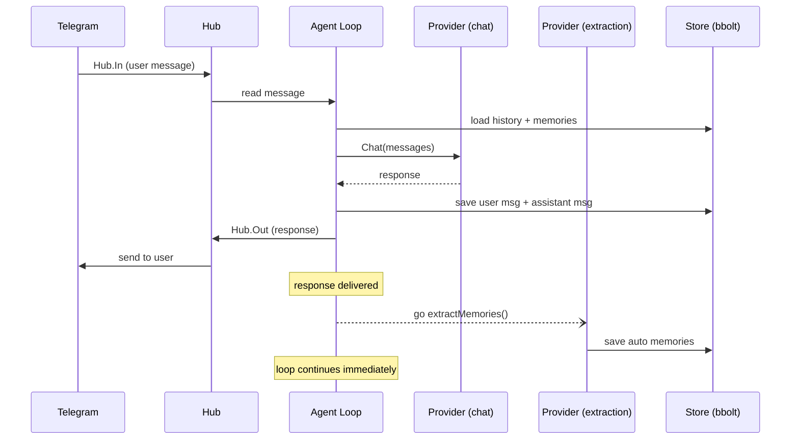

# Async Memory Extraction

PR #97 | Closes #69

## Overview

Previously, memory extraction happened synchronously in the agent loop -- the bot would call the LLM a second time to extract facts from each exchange before processing the next message. This blocked the entire message pipeline, adding 1-3 seconds of latency per message.

Async memory extraction moves the extraction call to a background goroutine. The user gets their response immediately; fact extraction happens concurrently without blocking the loop.

## Architecture

The extraction fits into the existing message flow as a fire-and-forget side effect after the response is sent:



The key change is that `Hub.Out <- response` happens **before** the extraction goroutine launches. The loop's `select` can pick up the next `Hub.In` message without waiting.

## Concurrency Design

The extraction goroutine in `handleMessage` follows a defensive pattern:

```go
l.wg.Add(1)
go func() {
    defer l.wg.Done()
    defer func() {
        if r := recover(); r != nil {
            slog.Error("panic in memory extraction",
                slog.Int64("chat_id", msg.ChatID), slog.Any("panic", r))
        }
    }()

    ctx, cancel := context.WithTimeout(context.Background(), 30*time.Second)
    defer cancel()
    l.extractMemories(ctx, msg.ChatID, msg.Text, response)
}()
```

Key decisions:

- **`sync.WaitGroup`** on the `Loop` struct tracks in-flight extractions. This enables graceful shutdown and deterministic testing.
- **`context.Background()`** instead of the parent context. The extraction must survive the parent context being cancelled (e.g., during shutdown the main loop context is done, but we still want running extractions to finish).
- **30-second timeout** prevents extractions from hanging indefinitely if the provider is slow.
- **Panic recovery** ensures a buggy extraction cannot crash the entire bot. The panic is logged and the goroutine exits cleanly via `wg.Done()`.

## Provider Selection

`pickExtractionProvider` selects which provider handles extraction calls:

```go
func pickExtractionProvider(p provider.LLMProvider) provider.LLMProvider {
    fb, ok := p.(*provider.Fallback)
    if !ok {
        return p
    }
    for _, pp := range fb.Providers() {
        if _, ok := pp.(*provider.OpenAI); ok {
            return pp
        }
    }
    return p
}
```

The logic:

1. If the provider is not a `Fallback`, use it directly (single-provider setup).
2. If it is a `Fallback`, scan for an `*provider.OpenAI` instance and prefer it.
3. Fall back to the original provider if no OpenAI-compatible provider exists.

**Why prefer OpenAI over Claude CLI?** The `claude -p` provider spawns a Node.js process per call. On the deployment target (512 MB RAM LXC), running two concurrent Node.js processes (one for chat, one for extraction) risks OOM. The OpenAI-compatible provider is a lightweight HTTP client with no subprocess overhead.

The extraction provider is resolved once at construction time in `NewLoop` and stored as `l.extProvider`.

## Trivial Message Filter

Before spawning an extraction goroutine, `handleMessage` checks:

```go
if isTrivialMessage(msg.Text) {
    return
}
```

A message is trivial if:
- It has fewer than 10 characters after trimming whitespace, OR
- It contains no spaces (single-word messages like "hi", "thanks", "ok")

This avoids wasting an LLM call on messages that cannot contain memorable content.

## Graceful Shutdown

When the main loop's context is cancelled, `Run` calls `drainExtractions`:

```go
func (l *Loop) drainExtractions() {
    done := make(chan struct{})
    go func() {
        l.wg.Wait()
        close(done)
    }()
    select {
    case <-done:
    case <-time.After(10 * time.Second):
        slog.Warn("timed out waiting for memory extractions to finish")
    }
}
```

This gives in-flight extractions up to 10 seconds to complete. If they do not finish (e.g., a provider is hanging), the bot shuts down anyway with a warning log. The 10-second drain timeout combined with the 30-second per-extraction timeout means worst case the bot waits 10 seconds on shutdown, not 30 -- any extraction that started more than 10 seconds ago will be abandoned.

The `Wait()` method is also exposed publicly for test synchronization.

## Testing

Key test scenarios in `internal/agent/loop_test.go`:

| Test | What it verifies |
|------|-----------------|
| `TestAutoExtraction` | End-to-end: chat response + background extraction produces auto-sourced memories in the store |
| `TestAutoExtractionDedup` | Extracted facts that already exist (checked via `store.HasMemory`) are not duplicated |
| `TestAsyncExtractionDoesNotBlockResponse` | Response arrives in <200ms even when extraction takes 200ms (uses `sequentialProvider` with per-call delays) |
| `TestTrivialMessageSkipsExtraction` | Sending "hi" results in exactly 1 provider call (chat only, no extraction) |
| `TestPickExtractionProvider` | Table-driven: non-fallback returns itself, fallback-with-OpenAI returns the OpenAI provider, fallback-without-OpenAI returns the fallback |

The `sequentialProvider` test helper returns different responses per call (first call = chat response, second call = extraction JSON) and supports per-call delays to verify async behavior. All async tests call `l.Wait()` before asserting on store state to avoid races.

## Configuration

No new configuration is required. The feature is always active -- extraction runs automatically for every non-trivial message. The extraction provider is selected automatically from the existing provider chain. The extraction prompt, trivial message threshold, drain timeout, and per-extraction timeout are compile-time constants.
